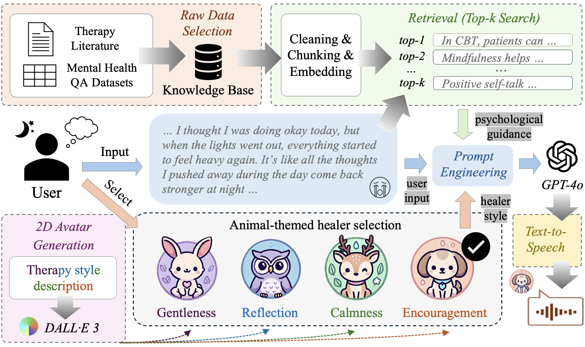
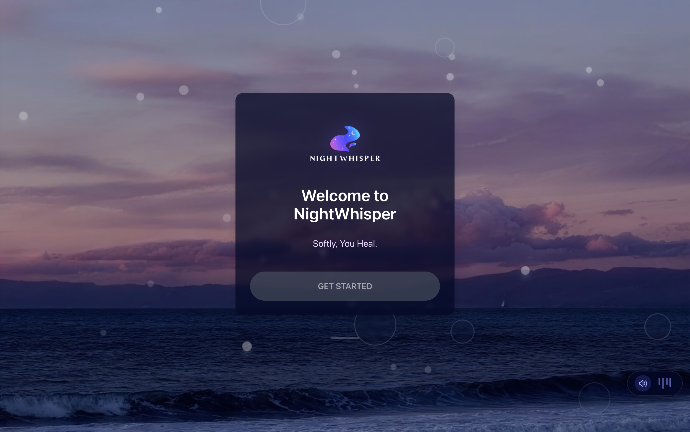
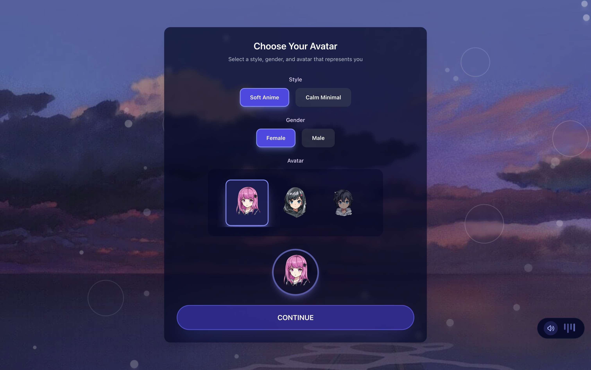
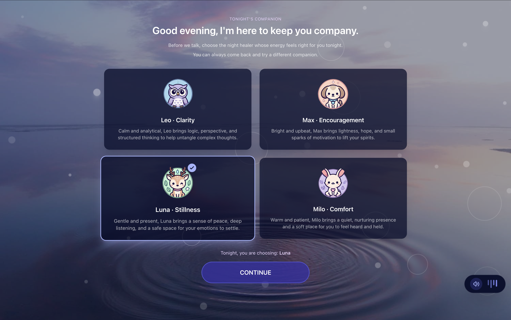
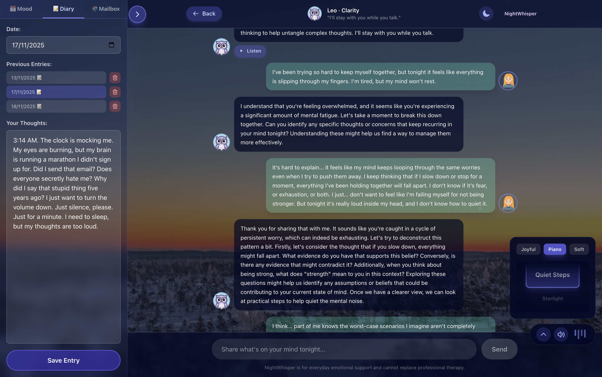

# NightWhisper 🌙

> **A Gentle Emotional Support Platform**  
> *Softly, You Heal.*

---

## Group Members

**COMP4431 Project - Group Members:**

- **Yang Jingwen** (23100669d)
- **Jin Yixiao** (23101231d)
- **Guan Zibo** (23101894d)
- **Leung Yungcheung** (22080308d)

---

## Table of Contents

1. [Project Overview](#project-overview)
2. [System Architecture](#system-architecture)
3. [Key Features](#key-features)
4. [Additional Features Implemented](#additional-features-implemented)
5. [Project Structure](#project-structure)
6. [Technology Stack](#technology-stack)
7. [Installation & Setup](#installation--setup)
8. [Running the Application](#running-the-application)
9. [Knowledge Base & Prompts](#knowledge-base--prompts)
10. [API Documentation](#api-documentation)
11. [Screenshots](#screenshots)
12. [Documentation](#documentation)

---

## Project Overview

**NightWhisper** is an AI-powered emotional support platform designed to provide users with personalized, empathetic companionship during difficult times. The system combines state-of-the-art natural language processing, retrieval-augmented generation (RAG), and text-to-speech (TTS) technologies to create a therapeutic conversational experience.

The platform features four unique AI healer personas, each with distinct personalities, therapeutic approaches, and voice characteristics. Users can select a healer that resonates with their emotional needs and engage in meaningful conversations supported by evidence-based mental health knowledge.

### System Workflow



The workflow diagram above illustrates the complete system architecture, from user input through AI processing to response generation.

---

## System Architecture

NightWhisper follows a modern full-stack architecture:

- **Frontend**: React + TypeScript application with Tailwind CSS for styling
- **Backend**: FastAPI-based RESTful API server
- **AI Engine**: GPT-4o with custom prompt engineering
- **RAG System**: LangChain + ChromaDB for knowledge retrieval
- **TTS System**: CosyVoice for voice cloning and speech synthesis

The system is designed with modularity in mind, allowing each component to be developed, tested, and maintained independently while working seamlessly together.

---

## Key Features

### 1. **Personalized Healer Selection**

Four unique AI healer personas, each with distinct personality traits, communication styles, and therapeutic approaches:

<div align="center">

| **Milo** (Rabbit) | **Leo** (Owl) | **Luna** (Deer) | **Max** (Dog) |
|:---:|:---:|:---:|:---:|
|  |  |  |  |
| **Comfort & Warmth** | **Clarity & Reflection** | **Stillness & Peace** | **Encouragement & Hope** |
| Warm and patient, brings a quiet, nurturing presence | Calm and analytical, brings logic and structured thinking | Gentle and present, brings peace and deep listening | Bright and upbeat, brings lightness and motivation |

</div>

### 2. **AI-Powered Conversations**
- GPT-4o integration with custom system prompts for each healer
- Context-aware responses that maintain conversation history
- Empathetic and therapeutic communication style

### 3. **Retrieval-Augmented Generation (RAG)**
- Integration with 9 mental health counseling datasets from HuggingFace
- Semantic search using sentence transformers
- Context injection to enhance response quality and accuracy

### 4. **Text-to-Speech (TTS)**
- Voice cloning using CosyVoice for each healer
- Zero-shot voice synthesis with unique voice characteristics
- Audio playback integrated into chat interface

### 5. **Beautiful User Interface**
- Night-time themed design with calming aesthetics
- Smooth animations and transitions
- Day/Night mode toggle
- Background music player with multiple tracks
- Responsive design for various screen sizes

### 6. **User Avatar Selection**
- Customizable user avatars with multiple styles
- Gender and style options
- Personalization for enhanced user experience

---

## Additional Features Implemented

Beyond the core requirements, NightWhisper includes several advanced features:

### 1. **RAG (Retrieval-Augmented Generation) System**
- **Implementation**: Built using LangChain, ChromaDB, and HuggingFace sentence transformers
- **Knowledge Base**: 9 mental health counseling datasets processed and indexed
- **Functionality**: Automatically retrieves relevant context from knowledge base based on user queries
- **Integration**: Retrieved context is seamlessly injected into GPT-4o prompts to enhance response quality

### 2. **Text-to-Speech (TTS) with Voice Cloning**
- **Technology**: CosyVoice zero-shot voice cloning
- **Features**: 
  - Unique voice for each healer persona
  - Real-time audio generation
  - Asynchronous processing to avoid blocking chat interface
- **Performance**: Optimized for both CPU and GPU execution

### 3. **Advanced UI/UX Features**
- **Day/Night Mode**: Toggle between themes for user preference
- **Background Music**: Integrated music player with multiple categories (Joyful, Piano, Soft)
- **Animations**: Smooth transitions, floating elements, and fade effects
- **Responsive Design**: Works seamlessly across different screen sizes

### 4. **Prompt Engineering**
- **Custom System Prompts**: Each healer has a carefully crafted system prompt defining personality and communication style
- **Safety Guidelines**: Built-in safety mechanisms to ensure appropriate responses
- **Context Management**: Intelligent combination of user input, conversation history, and RAG context

### 5. **Comprehensive Testing**
- **TTS Test Suite**: Comprehensive testing framework for TTS functionality
- **Dependency Verification**: Automated checks for all required dependencies
- **Performance Monitoring**: Built-in timing and performance metrics

---

## Project Structure

```
project-code/
├── src/                          # Frontend source code
│   ├── components/               # React components
│   │   ├── LandingScreen.tsx     # Landing page
│   │   ├── AvatarSelectionScreen.tsx  # User avatar selection
│   │   ├── HealerSelectionScreen.tsx   # Healer selection
│   │   ├── ChatScreen.tsx        # Main chat interface
│   │   ├── MusicPlayer.tsx       # Background music player
│   │   └── AnimatedBackground.tsx # Animated background effects
│   ├── api/                      # API client
│   │   ├── client.ts             # HTTP client for backend
│   │   └── types.ts              # TypeScript type definitions
│   ├── services/                 # Business logic services
│   │   └── chatService.ts        # Chat service with RAG integration
│   ├── data/                     # Static data
│   │   └── healers.ts            # Healer definitions
│   ├── types.ts                  # Global TypeScript types
│   ├── App.tsx                   # Main application component
│   ├── main.tsx                  # Application entry point
│   └── index.css                 # Global styles
│
├── backend/                      # Backend source code
│   ├── api/
│   │   └── server.py             # FastAPI server (main entry point)
│   ├── prompts/
│   │   └── healers.py            # Healer persona prompts (EDIT HERE)
│   ├── rag/                      # RAG implementation
│   │   ├── __init__.py
│   │   ├── build_kb.py           # Knowledge base builder
│   │   ├── retriever.py          # RAG retrieval functionality
│   │   ├── vector_store/         # ChromaDB database (generated)
│   │   └── README.md             # RAG documentation
│   ├── tts/                      # TTS implementation
│   │   ├── __init__.py
│   │   ├── cosyvoice_service.py  # CosyVoice TTS service
│   │   ├── test_tts_service.py   # TTS test suite
│   │   └── README.md             # TTS documentation
│   ├── CosyVoice/                # CosyVoice library (third-party)
│   │   ├── pretrained_models/    # Model files (download separately)
│   │   ├── bunny.wav             # Voice clone files
│   │   ├── owl.wav
│   │   ├── dear.wav
│   │   ├── dog.wav
│   │   └── original.txt          # Prompt texts for voice clones
│   ├── requirements.txt          # Python dependencies
│   ├── start_server.sh           # Server startup script
│   ├── .env                      # Environment variables (create this)
│   └── README.md                 # Backend documentation
│
├── public/                       # Static assets
│   ├── fig/                      # Images (backgrounds, avatars, etc.)
│   ├── avatar/                   # User avatar images
│   ├── music/                    # Background music files
│   ├── comp4431_workflow.png     # System workflow diagram
│   ├── page1.png                 # Screenshot: Landing page
│   ├── page2.png                 # Screenshot: Avatar selection
│   ├── page3.png                 # Screenshot: Healer selection
│   ├── page4-day.png             # Screenshot: Chat (day mode)
│   └── page4-night.png           # Screenshot: Chat (night mode)
│
├── proposal.pdf                  # Project proposal document
├── package.json                  # Frontend dependencies
├── tsconfig.json                 # TypeScript configuration
├── tailwind.config.js            # Tailwind CSS configuration
├── vite.config.ts                # Vite build configuration
└── README.md                     # This file
```

---

## Technology Stack

### Frontend
- **React 18.2.0** - UI framework
- **TypeScript 5.3.3** - Type-safe JavaScript
- **Tailwind CSS 3.4.0** - Utility-first CSS framework
- **Vite 5.0.8** - Build tool and dev server

### Backend
- **Python 3.10** - Programming language
- **FastAPI 0.104.1** - Web framework
- **Uvicorn** - ASGI server
- **Pydantic 2.7.0** - Data validation

### AI & ML
- **OpenAI GPT-4o** - Language model
- **LangChain** - LLM application framework
- **ChromaDB** - Vector database
- **HuggingFace Transformers** - Model library
- **Sentence Transformers** - Embedding models
- **CosyVoice** - TTS and voice cloning

### Data & Storage
- **HuggingFace Datasets** - Mental health datasets
- **ChromaDB** - Vector store for RAG

---

## Installation & Setup

### Prerequisites

- **Node.js** (v18 or higher)
- **Python** 3.10
- **Conda** (for environment management)
- **OpenAI API Key** (for GPT-4o access)
- **Git LFS** (for downloading CosyVoice model)

### Step 1: Clone the Repository

```bash
git clone <repository-url>
cd project-code
```

### Step 2: Frontend Setup

```bash
# Install Node.js dependencies
npm install

# The frontend is now ready to run
```

### Step 3: Backend Setup

```bash
# Create conda environment
conda create -n nightwhisper python=3.10
conda activate nightwhisper

# Navigate to backend directory
cd backend

# Install Python dependencies
pip install -r requirements.txt

# Create .env file for API keys
echo "OPENAI_API_KEY=your_openai_api_key_here" > .env
```

### Step 4: Build RAG Knowledge Base (Optional but Recommended)

```bash
# Make sure you're in the backend directory with nightwhisper environment activated
cd backend
conda activate nightwhisper

# Build the knowledge base (takes 30-60 minutes)
python -m rag.build_kb
```

This will:
- Download 9 mental health counseling datasets from HuggingFace
- Process and chunk the documents
- Create embeddings using sentence transformers
- Build a ChromaDB vector store

### Step 5: Setup TTS (Optional)

For text-to-speech functionality:

```bash
# Navigate to CosyVoice directory
cd backend/CosyVoice

# Create pretrained_models directory
mkdir -p pretrained_models

# Download CosyVoice model (requires Git LFS)
git clone https://www.modelscope.cn/iic/CosyVoice-300M.git pretrained_models/CosyVoice-300M

# Ensure voice clone files are in place:
# - bunny.wav (for Milo)
# - owl.wav (for Leo)
# - dear.wav (for Luna)
# - dog.wav (for Max)
```

**Note**: TTS generation is slow on CPU (3-5 minutes per message). GPU is recommended for production use.

---

## Running the Application

### Start Backend Server

```bash
# Activate conda environment
conda activate nightwhisper

# Navigate to backend directory
cd backend

# Start the server
./start_server.sh

# Or manually:
python api/server.py
```

The backend server will start on `http://localhost:8000`

### Start Frontend Development Server

```bash
# From project root directory
npm run dev
```

The frontend will start on `http://localhost:5173`

### Access the Application

Open your browser and navigate to:
```
http://localhost:5173
```

---

## Knowledge Base & Prompts

### Knowledge Base

The RAG system uses the following mental health counseling datasets:

1. `mrs83/kurtis_mental_health_final`
2. `samhog/psychology-RLHF`
3. `Felladrin/pretrain-mental-health-counseling-conversations`
4. `LuangMV97/Empathetic_counseling_Dataset`
5. `tolu07/Mental_Health_FAQ`
6. `thu-coai/augesc`
7. `nbertagnolli/counsel-chat`
8. `Amod/mental_health_counseling_conversations`
9. `ZahrizhalAli/mental_health_conversational_dataset`

These datasets are processed, chunked, and stored in a ChromaDB vector store for semantic search.

### Prompt Engineering

All healer prompts are defined in `backend/prompts/healers.py`. This file contains:

- **System Prompts**: Define each healer's personality, communication style, and therapeutic approach
- **Safety Guidelines**: Applied to all healers to ensure appropriate responses
- **Healer-Specific Configurations**: Custom settings for each persona

**To modify healer prompts**, edit `backend/prompts/healers.py` and restart the backend server.

The prompt system automatically combines:
- System prompt (healer personality)
- Safety guidelines
- RAG context (when available)
- Conversation history
- User input

---

## API Documentation

### Base URL
```
http://localhost:8000
```

### Endpoints

#### 1. Health Check
```
GET /health
```
Returns server status.

#### 2. Chat
```
POST /api/chat
Content-Type: application/json

{
  "healer_id": "milo",
  "user_input": "I'm feeling anxious",
  "conversation_history": [
    {"role": "user", "content": "Hello"},
    {"role": "assistant", "content": "Hi, how can I help you?"}
  ],
  "rag_context": "..." (optional)
}
```

Response:
```json
{
  "message": "I understand that anxiety can be overwhelming...",
  "error": null
}
```

#### 3. RAG Retrieval
```
POST /api/rag/retrieve
Content-Type: application/json

{
  "query": "anxiety management techniques",
  "top_k": 3
}
```

Response:
```json
{
  "chunks": [
    "Anxiety management involves...",
    "Deep breathing exercises can help...",
    "Cognitive behavioral techniques..."
  ],
  "error": null
}
```

#### 4. TTS Generation
```
POST /api/tts/generate
Content-Type: application/json

{
  "text": "Hello, I'm here to help you.",
  "healer_id": "milo"
}
```

Response:
```json
{
  "audio_url": "/api/tts/audio/tts_milo_abc123.wav",
  "status": "ready",
  "error": null
}
```

#### 5. TTS Audio Retrieval
```
GET /api/tts/audio/{filename}
```
Returns the generated audio file.

---

## Screenshots

### Landing Page, Avatar Selection, and Healer Selection

<div align="center">
  
  
  
</div>

### Chat Interface - Day and Night Modes

<div align="center">
  
  
</div>

---

## Documentation

### Project Documentation

- **Main README**: This file (`README.md`)
- **Backend Documentation**: `backend/README.md` - API endpoints, setup, architecture
- **RAG Documentation**: `backend/rag/README.md` - RAG system details
- **TTS Documentation**: `backend/tts/README.md` - TTS setup and performance notes

### Additional Resources

- **Project Proposal**: `proposal.pdf` - Detailed project proposal document
- **System Workflow**: `public/comp4431_workflow.png` - Visual system architecture diagram

### Key Files for Modification

- **Healer Prompts**: `backend/prompts/healers.py` - Edit healer personalities here
- **Frontend Healer Data**: `src/data/healers.ts` - Frontend healer definitions
- **API Server**: `backend/api/server.py` - Main backend server
- **Chat Service**: `src/services/chatService.ts` - Frontend chat logic with RAG

---

## Future Enhancements

Potential improvements for future versions:

1. **Caching System**: Cache frequently requested TTS audio and RAG responses
2. **User Profiles**: Save conversation history and preferences
3. **Multi-language Support**: Extend to support multiple languages
4. **Mobile App**: Native mobile application
5. **Advanced Analytics**: Conversation analytics and insights
6. **Integration with External Services**: Connect with mental health resources

---

## License

This project is developed for educational purposes as part of COMP4431 coursework.

---

## Acknowledgments

- **OpenAI** for GPT-4o API
- **HuggingFace** for datasets and model libraries
- **CosyVoice** team for TTS technology
- **LangChain** for RAG framework
- All contributors to the open-source libraries used in this project

---

<div align="center">

**NightWhisper** - *Softly, You Heal.* 🌙

Developed with ❤️ for COMP4431

</div>
